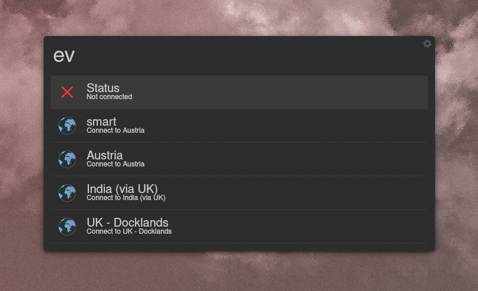
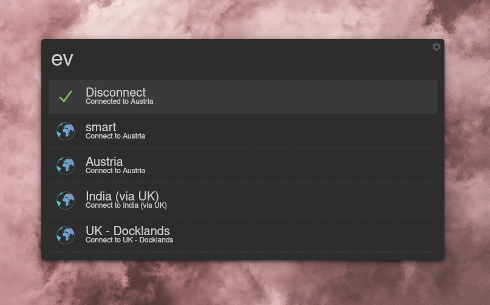

# Installation
Clone this repository into one of the folders according to [this](https://github.com/albertlauncher/plugins/blob/master/python/README.md#deployment). Becuase this is essentially just a wrapper around expressvpn, the expressvpn-cli needs to be installed and activated at well. Please look [here](https://www.expressvpn.com/support/vpn-setup/app-for-linux/) if you need help doing that. After these steps, you should be able to enable it in the settings of Albert (Settings -> Extensions -> Python).

# Usage
Just type in ```ev``` and you should be able to see possible vpn connections to connect to. 


